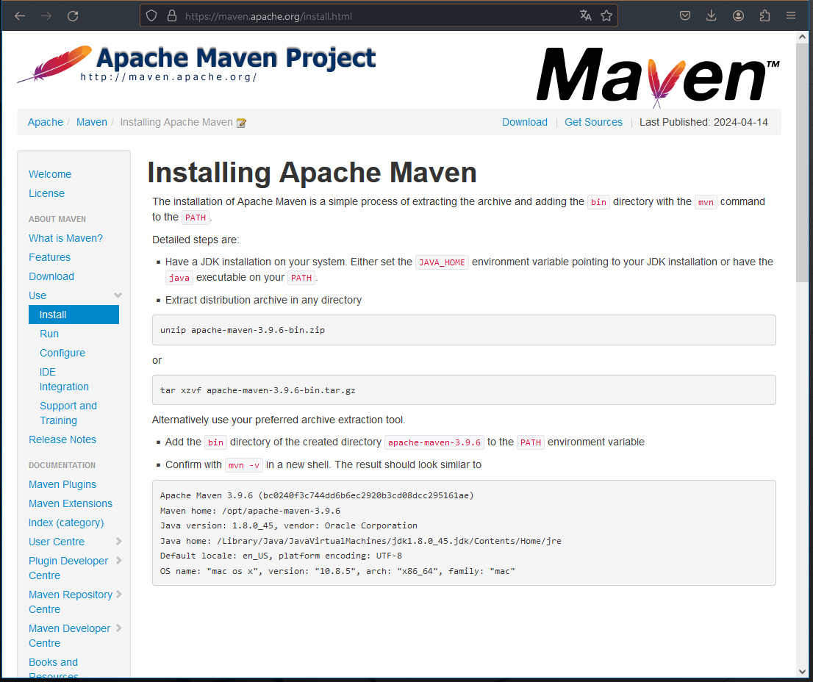

# HelloSpring

This is a basic Spring Web project to get a ready-to-use Java Spring project backbone

## Overview

Do you need to develop a Spring project with a web component? 

This repo provides a basic framework from which you can start, allowing you to enhance the code with your own objects and components

## Getting Started

### Install Maven first



In my experience, although Tomcat server is a dependency (a library) included in a Spring Boot project, Maven is not; in fact, Maven is an external tool that reads the pom.xml, downloads those libraries (including Tomcat), and compiles the code.

### Clone the repo

Clone the repository, either via the terminal or using a third-party tool.

### Test the app

Finally, open a terminal, browse to the main dir containing the project and run:

```
mvn spring-boot:run
```

If everything is good, the address: http://localhost:8080/web/greetings will show a form like this:

By entering any String, and submitting, the app says Hello:

Obviously, this feature is only for demonstration purposes and is intended solely to verify that the application is up and running properly.

From here, you can add and customize your own code.