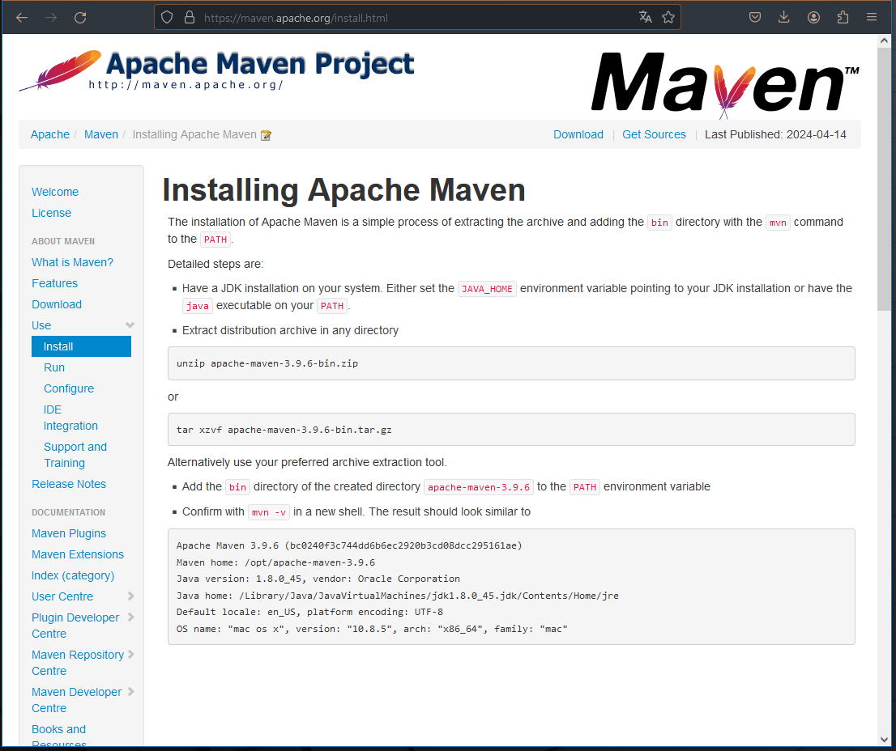
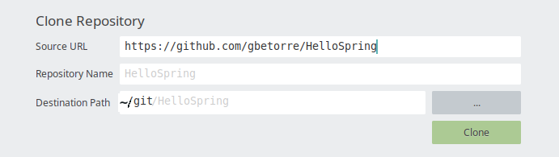
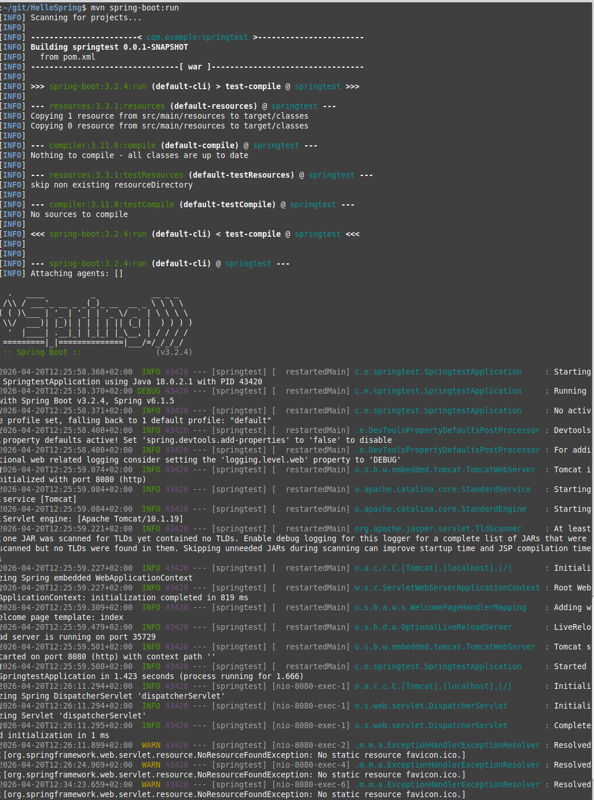
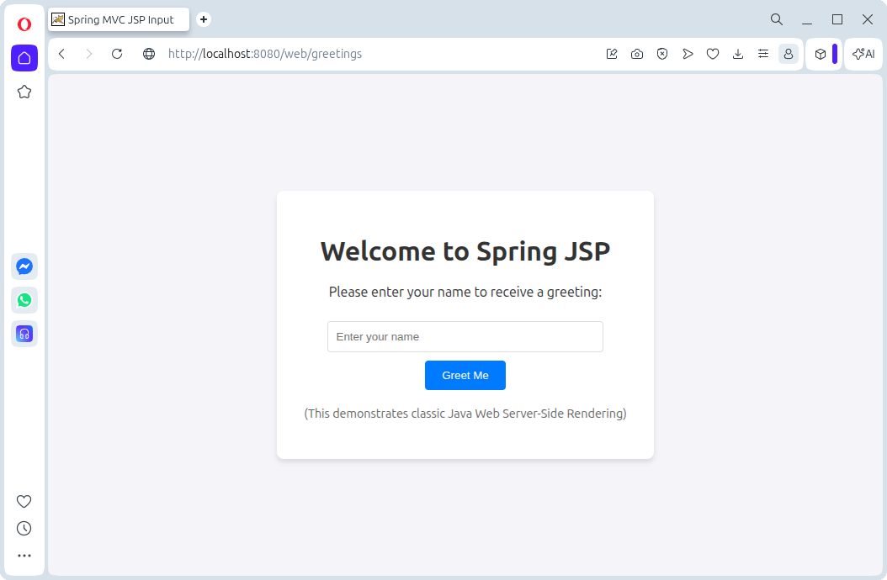
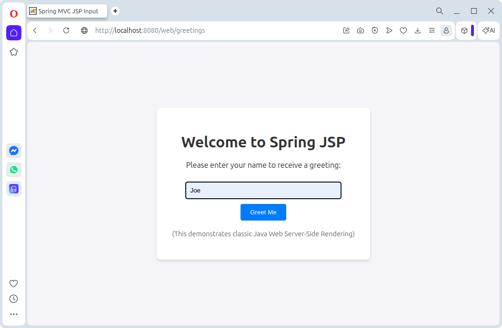
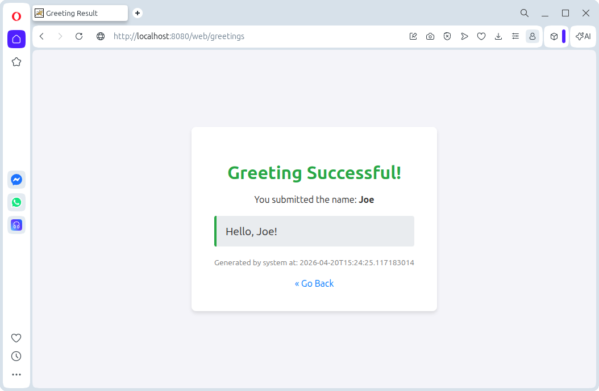

# HelloSpring

This is a basic Spring Web project to get a ready-to-use Java Spring project backbone

## Overview

Do you need to develop a Spring project with a web component? 

This repo provides a basic framework from which you can start, allowing you to enhance the code with your own objects and components

## Getting Started

### Install Maven first



In my experience, although Tomcat server is a dependency (a library) included in a Spring Boot project, Maven is not; in fact, Maven is an external tool that reads the pom.xml, downloads those libraries (including Tomcat), and compiles the code.

### Clone the repo

Clone the repository, either via the terminal or using a third-party tool.



### Test the app

Finally, open a terminal, browse to the main dir containing the project and run:

```
mvn spring-boot:run
```



If everything went good, the address: http://localhost:8080/web/greetings will show a form like this:



By entering any String, and submitting... 



...the app says Hello:



Obviously, this feature is only for demonstration purposes and is intended solely to verify that the application is up and running properly.

From here, you can add and customize your own code.

## Update

### About the port

As for the specified port, I updated the project configuration so that it listens on port 9080 instead of port 8080 (unlike what is shown in the screenshots before).

You’ll therefore need to enter the address: http://localhost:9080/web/greetings instead of the one shown above.

I thought this was the right choice because it’s very likely that, on a development machine, both port 80 and port 8080 are already occupied by previous configurations; so, the solution for testing additional configurations naturally involves configuring new ports (for instance, 8081, 8082, 8888...). 

Personally, I like to use the port 9080 - and I’ve been doing so since before [Netflix](https://github.com/rsaxvc/rsaxvc.net.blagr/blob/master/input/posts/Hacking/NetflixPlayerApi.blagr) even existed... ;-)
<br>
Enjoy and have fun with Spring!
